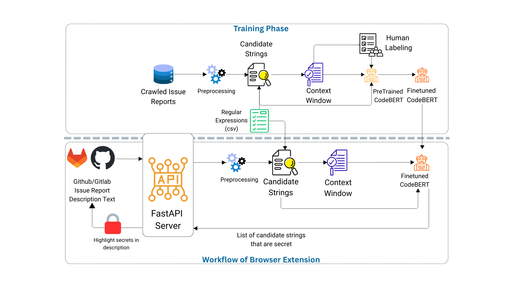

# IssueGuard: Real-Time Secret Leak Prevention Tool

IssueGuard is a Google Chrome extension designed to detect sensitive information such as API keys, tokens, passwords, and credentials within GitHub issue reports. The tool combines regex-based candidate extraction with a fine-tuned CodeBERT model to provide accurate, context-aware secret detection in real time.

This system helps users analyze issue content directly on the GitHub page, preventing accidental secret leakage without requiring developers to navigate away from their workflow.

The overall methodology of IssueGuard is shown below:



IssueGuard classifies extracted candidates into two categories: **Secret** and **Non-sensitive**, based on the annotation criteria defined in the following work:

*Sadif Ahmed, Md Nafiu Rahman, Zahin Wahab, Gias Uddin, and Rifat Shahriyar. "Secret Breach Prevention in Software Issue Reports." (2025).*
[Paper Link](https://2026.msrconf.org/details/msr-2026-technical-papers/15/Secret-Leak-Detection-in-Software-Issue-Reports-using-LLMs-A-Comprehensive-Evaluatio)


## System Requirements

- Python 3.12.0 or higher  
- Google Chrome browser


## Installation and Setup

### Clone the Repository

```bash
git clone https://github.com/nafiurahman00/IssueGuard.git
cd IssueGuard
```

### Download the Model
Download the pre-trained CodeBERT model from GitHub releases:

1. Go to the [GitHub Releases page](https://github.com/nafiurahman00/IssueGuard/releases)
2. Download the `models.zip` file from the latest release
3. Extract the `models.zip` file in the root directory of the project

After extraction, verify that the model files are present at:  
`models/balanced/microsoft_codebert-base_complete/`

### Start the FastAPI Server

**Option 1: Using Docker (Recommended)**
```bash
docker compose up --build
```
> Requires [Docker](https://docs.docker.com/get-docker/) and [NVIDIA Container Toolkit](https://docs.nvidia.com/datacenter/cloud-native/container-toolkit/install-guide.html) for GPU support.

> **⚠️ Linux Users — Docker Desktop Not Supported for GPU**
>
> On Linux, **Docker Desktop does not support GPU passthrough** because it runs containers inside an isolated virtual machine that cannot access the host's NVIDIA drivers. As a result, `docker compose up` will fail with:
> ```
> Error response from daemon: could not select device driver "nvidia" with capabilities: [[gpu]]
> ```
>
> **You must use the native Docker Engine instead.** Here is how to set it up:
>
> **1. Install Docker Engine:**
> ```bash
> sudo apt-get install docker-ce docker-ce-cli containerd.io docker-buildx-plugin docker-compose-plugin
> ```
>
> **2. Install NVIDIA Container Toolkit:**
> ```bash
> curl -fsSL https://nvidia.github.io/libnvidia-container/gpgkey | \
>   sudo gpg --dearmor -o /usr/share/keyrings/nvidia-container-toolkit-keyring.gpg \
>   && curl -s -L https://nvidia.github.io/libnvidia-container/stable/deb/nvidia-container-toolkit.list | \
>   sed 's#deb https://#deb [signed-by=/usr/share/keyrings/nvidia-container-toolkit-keyring.gpg] https://#g' | \
>   sudo tee /etc/apt/sources.list.d/nvidia-container-toolkit.list \
>   && sudo apt-get update
> sudo apt-get install -y nvidia-container-toolkit
> ```
>
> **3. Configure the NVIDIA runtime and restart Docker:**
> ```bash
> sudo nvidia-ctk runtime configure --runtime=docker
> sudo systemctl restart docker
> ```
>
> After completing these steps, `docker compose up --build` will work correctly with full GPU acceleration. If you have Docker Desktop installed, you can continue using it for non-GPU workloads, but for this project you must run commands through the Docker Engine context (`docker context use default`).

**Option 2: Run Directly**

### Install Python Dependencies
```bash
pip install -r requirements_fastapi.txt
```
```bash
python main.py
```

### Install the Chrome Extension
1. Open Google Chrome and navigate to `chrome://extensions/`.
2. Enable "Developer mode" using the toggle switch in the top right corner.
3. Click on "Load unpacked" and select the `IssueGuardExtension` directory from the cloned repository.
4. The IssueGuard extension should now appear in your list of extensions.

### Usage

1. Ensure the backend server is running
2. Open any GitHub issue creation page
3. Start writing or pasting text in the issue description box

IssueGuard will automatically analyze the content.
Detected secrets are highlighted, and a tooltip lists all true secrets identified by the model.
Regex-captured false positives are ignored based on the model’s classification.

Example GitHub issue pages for testing:

https://github.com/*any-repo*/issues/new

Any public issue creation form containing text inputs

### Links
Video demonstration: https://www.youtube.com/watch?v=kvbWA8rr9cU

